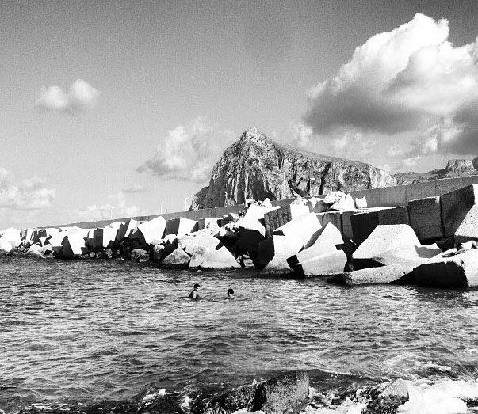
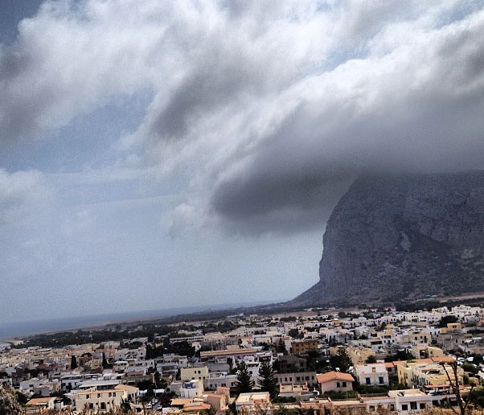
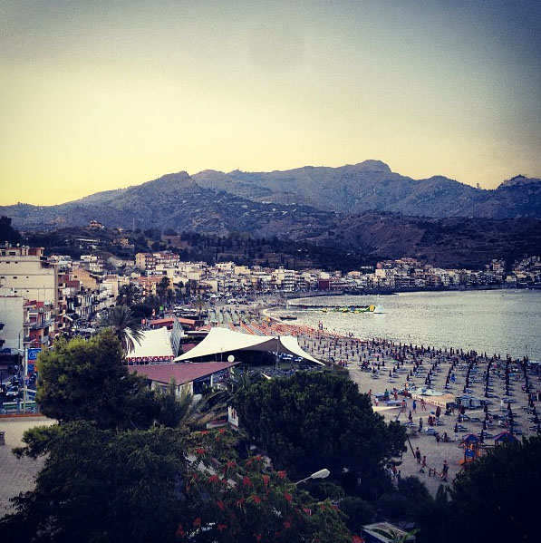
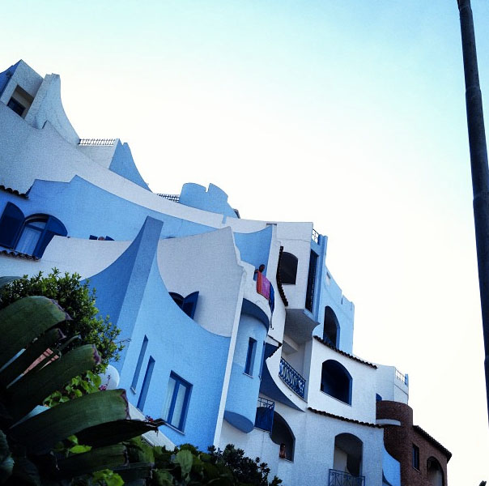
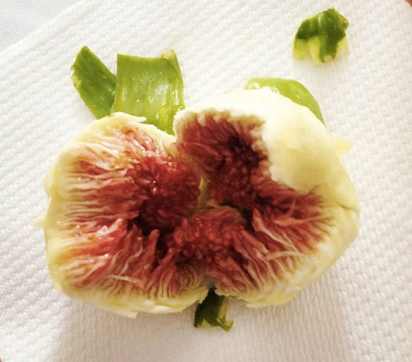

 

Riserva Dello Zingaro
 
 

 

Sun Dried Tomatoes in Balata di Baida
 
 

 

Raid Dell Etna
 
 

 

Triskelion Souvenir
 
 

 

Porto Di San Vito Lo Capo
 
 

 

I Giardini Di San Vito Lo Capo
 
 

 

Hotel Sporting Baia
 
 

 

Hotel Sporting Baia
 
 

 

Comune di Giuliana
 
 

 

Italian Fig
 
 

 

- 

  
This is just a short quasi-guest post. My roommate, Joey, just returned (bronzed, chipper and wanderlustful) from a three week trip to Sicily. We both have family and roots in Messina, a coastal city in Sicily. He primarily stayed with family in San Vieto, but also visited Messina, Giuloana, Taramena, Palermo, Cefalu and Troina. I’ve posted a slideshow of some of his [Instagram](http://instagram.com/josephcricchio) pictures from the trip. He brought me back a ceramic [triskelion](http://en.wikipedia.org/wiki/Triskelion), which is the ancient symbol of Sicily.